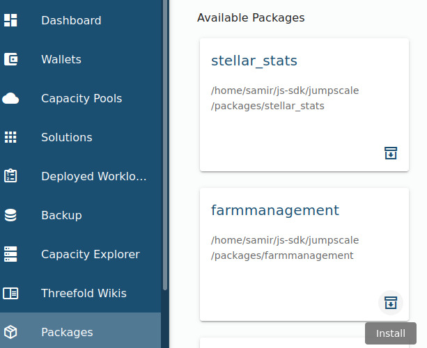

# Farm Initialization

This page explains how to register a farm on the TF Grid.

## Install the Farm Management Application
Install the farm management application. To do so, click `Packages` tab on the left side menu in your 3bot instance. Then go to `Farm Management` package 
Then click on  the `Install` button.



Once the package is installed, the page will reload and the `Farm Management` UI will appear on the left side menu click on it and you will see your farm configuration page.

## Create a Farm

> **Important**: Before creating farm, makes sure your 3Bot is configure to use the network you want to use. The TF Grid has 2 different networks, Mainnet and Testnet. 

To create a new farm, click the plus (+) button on the top left corner. It will open a form to create a new Farm.


Here's an explanation of each field:

* **Farm name**: This is the name you want to give to your farm. The name can be changed at any time. A name is important for users to find your farm easily.
* **Organization ID**: This field is only useful if you are migrating a farm from the TF Grid v1. If you are creating a new farm from scratch, you can ignore it.
* **Email address**: This email address is associated with your farm and will be used for all communication with the farmer.
* **Country**: This field is optional but still recommended as users are expected to seek for farms located closest to them.
* **Wallet addresses**: This the address where rewards from farming and renting capacity will be received on. At the time of writing, there are 2 supported tokens: TFT and TFTA. You can use any wallet to generate your addresses, you just need to make sure the right [trust line](https://www.stellar.org/developers/guides/concepts/assets.html) is created.

**Make sure you add a valid TFT Stellar address.** This is required for a user to be able to reserve capacity from your farm.

Once the farm is created you should see a new entry in the top table.

Notice the first column of the table: ID. This is your farm ID. Write it down and store it securely as you will need it when generating the Zero-OS image for the 3nodes of your farm.


## Use API to check result of creation of farm

You can also check with an API call if your farm is created successfully.

- Mainnet: https://explorer.grid.tf/explorer#api-Farms-getFarm
- Testnet: https://explorer.testnet.grid.tf/explorer#api-Farms-getFarm

Example:

```bash
curl -X GET "https://explorer.testnet.grid.tf/explorer/farms/13646"
{"id":13646,"threebot_id":954,"iyo_organization":"","name":"kristoftest","wallet_addresses":[{"asset":"TFT","address":"GCKOETVYOPF5GW4L5J3EN3RG6Q4WVJ2V3SV5GWNEDY2JBZU75J6XGJE3"}],"location":{"city":"","country":"Belgium","continent":"","latitude":0,"longitude":0},"email":"","resource_prices":null,"prefix_zero":""}
```

<!-- !!!include:bootable_image -->
