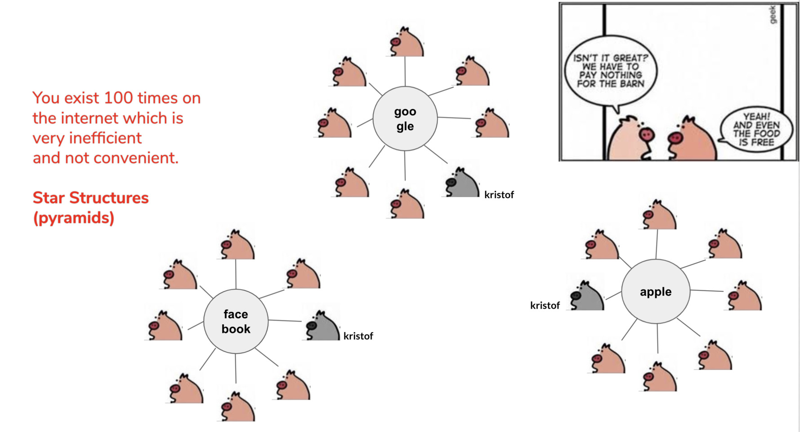

# Energy Savings Digital Twin

In this document we walk you through how much more energy-efficient a digital twin is relative to the world’s status quo.

## The world consumes too much energy, we need to do better.

To power 4 Billion people with a system like ours we need less that 10 giga-watts of power (see [calculation](energy_savings_digital_twin_calc)).

 > Each twin uses about 2.4 watts of power.  
 > This means we can host 25 digital twins on an electricity budget of a 60-watt lamp.

## How else can we save power:

- network: at least 10x less due to requiring less bandwidth
- consumer devices: probably not much

> **Conclusion: we can certainly save between 10 and 100 times on global power requirements for our digital life, we believe this is incredible - and worth the effort.**

[calculation see here](energy_savings_digital_twin_calc)

## Why the world is consuming so much energy:

### The high level problem

In today’s digital world, on average our digital selves exist on more than 100 separate platforms. This is super inefficient!

For each use case (e.g. facebook, amazon, gmail, …) we exist within a huge system of databases and compute front ends. Google, for their mail and office alone, has millions of servers.

### Only One digital twin required:

To run your digital life you only need one digital twin to be alive instead of existing on 100 different client-server systems.

Each digital twin is highly efficient for maintaining your digital life.

All these digital_twins talk directly to each other in a peer2peer way, leading to a tremendously efficient organic system.

### Why are we so efficient compared to a centralized system?

Typically we can host more than 100 users on a small host (computer) costing less than 2000 EUR.

We have to ask ourselves, how much active data are we working with at any point in time?

We believe this is not more than 100 MB of data.

Bigger files (video/audio) are streamed to the back end but you don’t use them all the time but if you do, they are very easy to cache e.g. a video of 1 GB requires about one hour or more to watch.

The other content we regularly deal with are messages, structural data, etc. These easily fit within 100 MB of memory.

This means that a digital twin can keep most data in memory that you use at that time, so that the twin only infrequently needs to access the back end, thereby saving an amazing amount of energy.

By keeping more things in memory the following advantages apply

- a lot fewer context switches: avoid_context_switches
- no stress on backend storage system
- no SSD access required

### Up to 100 times less networking required:

Today in our digital life we must go to centralized locations for most of what we do.

If two people in a village in Africa send a message to each other, the message is first routed to a distant centralized datacenter e.g. in United States, where it will go to another location in the world, before heading back to the recipient who fetches it through their web based email client.

This is super inefficient.

- the message travels many thousands of km (instead of 2 km)
- the message needs to go over two centralized mail systems (sometimes over multiple hops)
- the message is stored in large databases (twice)

This is not needed, with a digital twin the sender talks to his twin which is close to him, that twin will find the other nearby twin and send the message directly. The twins are probably close to each other because the sender and receiver twins are in the same city. This leads to a much more efficient way to deal with data transport.

Networking uses a lot of power in the world (see graph below), thanks to our approach, in most circumstances we can save a lot of energy here.

!!!include:effect_cooling

### Avoiding context switches:

In client server systems, there are many software layers.
In the world today everything is a client server system.

Database layers, software defined networking, storage and network virtualization, hypervisors, process managers, ...

Each of these layers have to do lots of context switches.

Context switches are the main cause inefficiency in servers.

A context switch happens when the CPU needs to switch data out of memory so it can process something for a specific process. Whenever another process needs to use the same CPU, the memory required for that process needs to be transferred into the CPU. 

On busy servers the amount of context switching is huge, the more layers, the more context switching.

We have seen server systems which are only usable for less than 20% of their real capacity compared to pre-emptive multi tasking.

Thanks to the design of a digital twin a lot of these context switches are avoided leading to a much more efficient system.

### Usage of a fast development language:

The Digital Twin is compiled in the C programming language. C is a very fast language and allows us to be extremely efficient in utilization of hardware resources.

### Digital Twin Uses Our Quantum Safe Storage System:

See qsss. 

The energy usage for storage in our design is super low see [energy_savings_storage](energy_savings_storage).

Thanks to this design every digital twin can store data over multiple nodes, in complete security yet under full control, and saving lots of energy, see that [doc](energy_savings_storage).

### Many more tricks:

There are many more energy-saving tricks that we will implement in the future, e.g:

- pre-emptive multitasking for all actions: avoiding even more context switching
- do more of the low level algorithms in e.g. FPGA CPU's
- liquid cooling

## Calculation:

see [digital twin power savings calc](energy_savings_digital_twin_calc)

!!!include:energy_savings_toc
