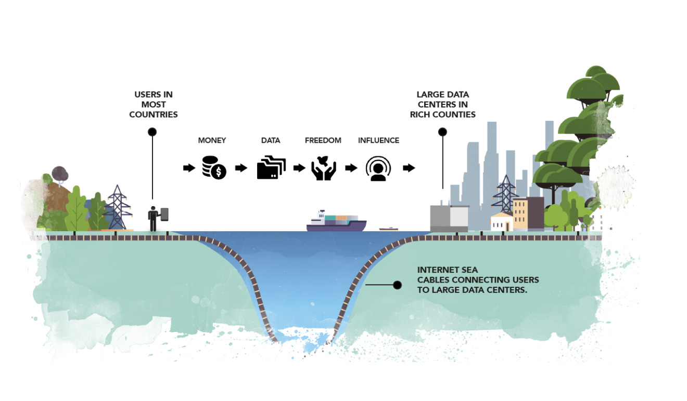

# A Troubled Industry 

Without adequate Internet Capacity, companies and societies are unable to develop and evolve - yet this is the future we face today. 

Over the past decade, the spectacular advancement of Internet Capacity has been due in large part to the hyper-scale efficiencies of multi-billion-dollar data centers. But this model is fast becoming obsolete. Short-term demand for Internet Capacity is far outpacing available supply, thanks to power-intensive applications like Big Data, the Internet of Things (IoT), and Artificial Intelligence (AI). 
Unsovereign Internet Infrastructure 

In 2020, cloud infrastructure providers account for 53% of global traffic, out of which Amazon, Google, Microsoft, Facebook will deliver more than 80% of the payload. While the cloud will deliver the majority of the workloads, the future of the internet stands at a risk of being consolidated, centralized, and at the mercy of these providers. The primary driver of cloud adoption is the promise of flexibility and cost advantage, but the reality is that the products offered by cloud providers are overpriced, complicated and lock clients into ecosystems that limit their ability to innovate, compete and operate within their own internet network, and as a matter of fact, emerging countries’ needs, or else they remain unconnected. Nearly 3.7 billion people still do not have access to internet facilities which creates a huge global inequality and unfairness towards the accessibility to education, information, and knowledge. 

In other words, it is the same as using long cables from the Internet Service Provider “Country” to the Client “Country” to provide internet. Yet, these countries do not extract a lot of benefits from it. Our data is stored in centralized power-hungry data centers owned by well-known companies which are then sold to third parties as part of their business model - encouraging a system with no privacy. 

## Cost Ineffective 

The internet is too expensive for the individual and for most countries. Assuming that Internet usage means consuming 500 megabytes of data per month at current prices, only 17% of people in South Asia and 11% of people in Sub-Saharan Africa can afford to use the Internet - Please note that the estimation is still less than an average mobile data user consumes in developing countries. To make the internet affordable to everybody, global prices would need to fall by an average of 90% which is implausible with current infrastructure costs. 

## Lack of Security due to Centralization Architectures  

One major problem with current centralized systems is that they run on centralized architectures. Every internet company has its own data centers, where it stores user data and runs its applications. This entails some serious security and privacy concerns. 

Worldwide-known examples such as the data breach of Equifax or Yahoo showed us how bad things can get when data is stored in one location resulting in data leaks and loss - Equifax: security incident led to the financial and personal data of 145 million people finding its way into the hands of malicious actors. Yahoo: loss of data belonging to 3 billion user accounts. 

Meanwhile, centralized architectures suffer from single points of failure. When the servers of centralized services such as Google Drive or Amazon Web Services fail, all the websites and applications that depend on them stop working. Additionally, they are also vulnerable to Denial of Service and Distributed Denial of Service (DoS/DDoS) attacks, because they provide attackers with a single target to hit.

## Lack of Security Due to Human Error 

The current IT stack depends on human error and it has been considered as the major cause of cybersecurity breaches with more than 95% of the cases. Human errors allow attackers to access encrypted channels and sensitive information 

## Unsustainable Infrastructure

Power-hungry data centers consume energy at unsustainable rates. The gigabytes of data we’re using come at a significant cost to the environment. Together, with all the data centers around the world, they represent over 2 trillion gigabytes of storage and consume around 205 TWh - More than the State of New York City. 

## Trouble to Cater for Future Demand

If we meet the projected demand for 2022, more than 4,000 new data centers, costing an estimated $5 trillion, will be needed to build and consume an additional 400 GW/h. This is roughly equivalent to Japan’s energy consumption and would place an impossible strain on the global electricity grid. Already, demand for data center storage is causing memory shortages and price hikes. 

There is a need for modernizing the data infrastructure and this is empowered through ThreeFold.

# Our Solution - ThreeFold

We decided to turn around the current digital miasma and create from scratch a new internet infrastructure that is decentralized, fully peer-to-peer, secured, and more sustainable - ThreeFold Grid. ThreeFold developed this new infrastructure formed by people and organizations that connect Internet Capacity (Compute, Storage, and Network Capacity) anywhere where electricity and network can be found. As such, this solution is providing the possibility for any country to have their own internet and be sovereign. This will, therefore, be the gateway towards providing the internet to the global population which will allow fair access to education, information, and knowledge - Knowledge is the key driver of prosperity, happiness, and the advancement of human civilization. 