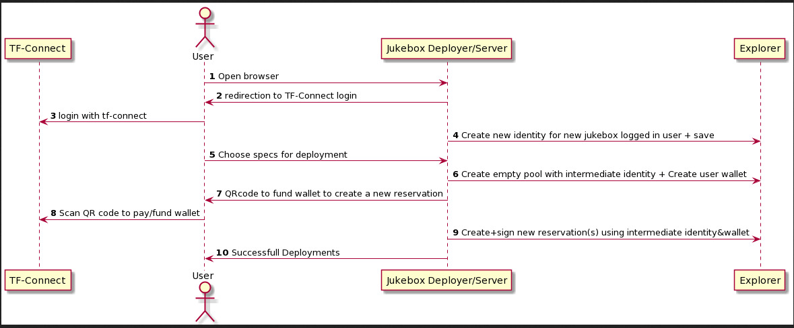

## Specs

Here you will find technical specification of Blockchain Jukebox.

## System requirements

System that is easy to provision blockchain nodes (public, private)
- User can create x blockchain nodes on a random or specific locations on the TF Grid
- User can list their blockchain nodes
- Should the user have ssh access to the node?
- Check node status/info
- External authentication/payment system using the ThreeFold Connect app
- User can delete their blockchain nodes
- User can access their blockchain nodes?

## Non-Functional requirements

- How many expected concurrent users: 100
- How many users on the system: 10000-100000
- Expected Data volume: max would be 1000 solution per user, 1KB metadata max per solution around 1MB per user, max data size would be 100GB.
- Data store: filesystem (is better)
- How critical is the system? It needs to be alive all the time, can afford a few mins being down.
- Life cycle of the nodes? How does the user keep their nodes alive? We regularly ask the user to top-up their pools using *notifications* to extend the pools (background service).
- Grid workload to deploy the blockchain nodes: So far containers all blockchain nodes are working fine on IPv6.
- Intermediate identity on deployer for each user: Will be used to sign reservations.
- Wallet for each user: Will be used to pay by user for reservations that will be asked during deployment.
- Backup: It is required to backup the machine that is running the deployer to s3.
- In case the node goes down for some reason should we just warn the user or we need to redeploy?
    - In case of redeploying: First we add ourselves to the list for delete signers to be able to delete it and then the user will be asked to issue /redeploy from bot to bring back the deleted node.

## Components mapping / SALs

- Entities: User, Blockchain Node
- ReservationBuilder: Builds reservation and signs with the intermediate identity.  
- UserInfo: User info is loaded from ThreeFold login system.
- Blockchain Node (role, configurations) 
- User notifications / top-up
   - Notifications on deployer website
- Service view: web interface
- Monitoring: Monitoring + redeployment of the solutions again if they go down using intermediate identity.
- Logging 

## Tech stack

- JS-SDK
- tf_jukebox 

### Zero-OS

- There are some blockchain nodes that requires IPv4, if we decide to include them in the deployer, we have two options:
   - Containers to support IPv4
   - We start them in VMs

## Blockchains IPv4/IPv6 status

| Partner                  	| Node Type        	| IPv4      	| IPv6      	|
|--------------------------	|------------------	|-----------	|-----------	|
| **Dash**                     	| Full             	| Yes       	| Yes       	|
|                          	| Master           	| Yes       	| Yes       	|
| **Digibyte**                 	| Full             	| Yes       	| Yes       	|
|                          	|                  	|           	|           	|
| **Matic (Polygon)**          	| Sentry           	| Yes       	| No        	|
|                          	| Full             	| Yes       	| No        	|
|                          	| Validator        	| Yes       	| No        	|
| **Presearch**                	| Basic            	| Yes       	| No        	|

## Sequence Diagram using blockchain deployer website 
### Preferred Solution

- Blockchain deployer where we can only deploy vms/containers directly on the grid without the need to have a VDC
- Users will only need to login with the ThreeFold Connect app to the portal and will only have to pay to intermediate wallet by scanning QR code from the browser.
- The advantage of this solution is that user experience will be consistent across our grid services (VDC deployer, 3bot deployers, Marketplace, ..). 

